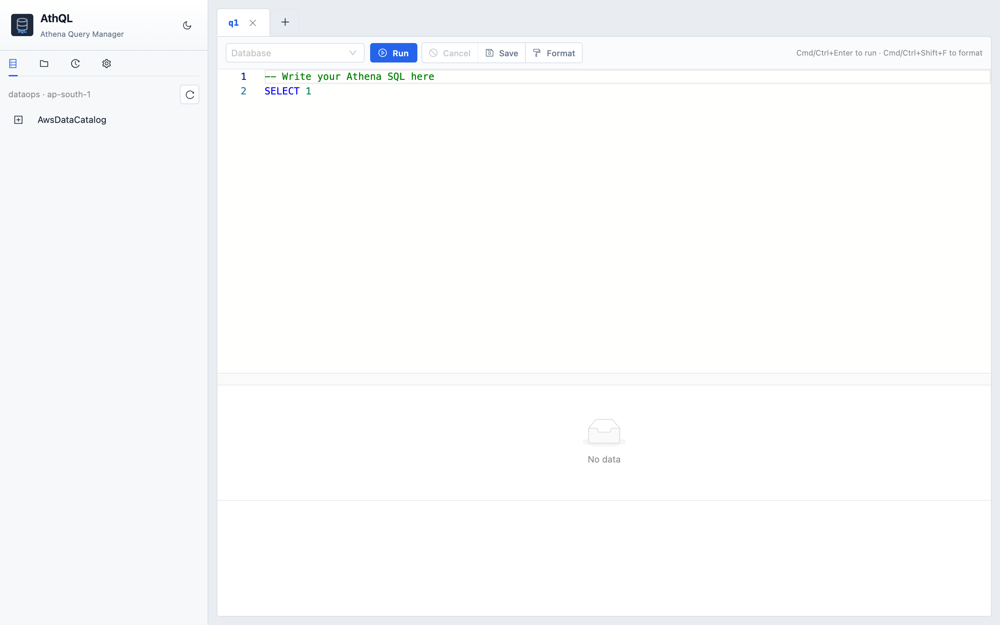

# AthQL

A local-first Amazon Athena query manager for developers. Runs on your machine using `~/.aws/credentials`, reads settings from `config/athql.env`, and stores saved queries and history in `~/.athql/metadata.db`.

- **Website:** [amit3200.github.io/AthQL](https://amit3200.github.io/AthQL/)
- **Repo:** [github.com/Amit3200/AthQL](https://github.com/Amit3200/AthQL)
- **Version:** `1.1.0` — [CHANGELOG](CHANGELOG.md) · [Releases](https://github.com/Amit3200/AthQL/releases)

[](https://github.com/Amit3200/AthQL/releases)

## Screenshots

### Workspace & catalog

Multi-tab SQL editor, Glue catalog explorer, database picker, and run/save/format toolbar.


### Light theme

Same workspace in light mode — useful for daytime use or sharing with teams that prefer a lighter UI.



### Results & saved queries

Scrollable results preview with scan stats and cost estimate, plus saved queries organized in folders with tags.

> I built AthQL for *my* productivity. Then I realized a README needs screenshots, so now I’m staging fake `generic_datastore` pipelines and `platform_datastore.PLATFORM_ORDERS` for all of you 😂 Real prod data stays locked down — but hey, I don’t mind sharing this screenshot *with* Gemini while Gemini generates the dummy data. Very meta. Very secure.


## Architecture

```
frontend/          React + Vite + Ant Design + Monaco + TanStack Query
backend/           FastAPI + PyAthena + SQLGlot + Boto3 + SQLite
config/athql.env   Local AWS profile, region, workgroup (gitignored)
~/.athql/          SQLite metadata (folders, saved queries, history)
```

### Query lifecycle

1. Frontend submits SQL → backend starts Athena execution (non-blocking)
2. Frontend polls status every 1.5s via React Query
3. On success, backend returns first ~200 rows via `GetQueryResults`
4. Full CSV download uses a pre-signed S3 URL (browser → S3, no Python memory spike)

## Prerequisites

- Python 3.9+
- Node.js 20+
- AWS credentials for a profile that can use Athena and Glue (`~/.aws/credentials`)
- An Athena workgroup in your target region (often `primary`)
- IAM permissions listed below (or equivalent managed policies)

## AWS IAM permissions

AthQL calls AWS APIs directly from your local machine using the configured profile. The IAM principal needs permissions for **catalog browsing**, **query execution**, and **result access**.

Replace `REGION`, `ACCOUNT_ID`, `WORKGROUP`, and bucket names with your values.

### By feature

| AthQL feature | AWS service | IAM actions |
|---------------|-------------|-------------|
| Profile / account detection | STS | `sts:GetCallerIdentity` |
| Catalog explorer (databases, tables, columns) | Glue | `glue:GetCatalogs`, `glue:GetDatabases`, `glue:GetTables`, `glue:GetTable` |
| Workgroup / output location detection | Athena | `athena:GetWorkGroup`, `athena:ListQueryExecutions`, `athena:GetQueryExecution` |
| Run / cancel / poll queries | Athena | `athena:StartQueryExecution`, `athena:StopQueryExecution`, `athena:GetQueryExecution` |
| Results preview in UI | Athena | `athena:GetQueryResults` |
| Full CSV download | S3 | `s3:GetObject` on the Athena results bucket (via pre-signed URL) |
| Athena writing query results | S3 | `s3:PutObject`, `s3:GetObject`, `s3:ListBucket`, `s3:GetBucketLocation` on the **output** bucket/prefix |

`glue:GetCatalogs` is optional — if denied, AthQL falls back to `AwsDataCatalog`.

### Querying your data (separate from AthQL itself)

Running `SELECT … FROM my_db.my_table` also requires whatever your tables need in Athena:

- **Glue:** `glue:GetDatabase`, `glue:GetTable`, `glue:GetPartitions` (and sometimes `glue:GetTables`) on the databases/tables you query
- **S3:** `s3:GetObject` (and often `s3:ListBucket`) on the **data** buckets backing those tables
- **Lake Formation:** if your org uses LF, you may also need LF data permissions/grants on those resources

AthQL cannot query data your IAM user wouldn't be able to read in the AWS Athena console with the same profile.

### Example least-privilege policy

Scoped to one workgroup, Glue catalog metadata, and a dedicated Athena results bucket:

```json
{
  "Version": "2012-10-17",
  "Statement": [
    {
      "Sid": "AthQLIdentity",
      "Effect": "Allow",
      "Action": "sts:GetCallerIdentity",
      "Resource": "*"
    },
    {
      "Sid": "AthQLGlueCatalogRead",
      "Effect": "Allow",
      "Action": [
        "glue:GetCatalogs",
        "glue:GetDatabases",
        "glue:GetDatabase",
        "glue:GetTables",
        "glue:GetTable",
        "glue:GetPartitions"
      ],
      "Resource": [
        "arn:aws:glue:REGION:ACCOUNT_ID:catalog",
        "arn:aws:glue:REGION:ACCOUNT_ID:database/*",
        "arn:aws:glue:REGION:ACCOUNT_ID:table/*/*"
      ]
    },
    {
      "Sid": "AthQLAthenaWorkgroup",
      "Effect": "Allow",
      "Action": [
        "athena:GetWorkGroup",
        "athena:ListQueryExecutions",
        "athena:GetQueryExecution",
        "athena:StartQueryExecution",
        "athena:StopQueryExecution",
        "athena:GetQueryResults"
      ],
      "Resource": [
        "arn:aws:athena:REGION:ACCOUNT_ID:workgroup/WORKGROUP",
        "arn:aws:athena:REGION:ACCOUNT_ID:datacatalog/AwsDataCatalog"
      ]
    },
    {
      "Sid": "AthQLAthenaResultsBucket",
      "Effect": "Allow",
      "Action": [
        "s3:GetBucketLocation",
        "s3:ListBucket",
        "s3:GetObject",
        "s3:PutObject"
      ],
      "Resource": [
        "arn:aws:s3:::your-athena-results-bucket",
        "arn:aws:s3:::your-athena-results-bucket/athena/queries/*"
      ]
    }
  ]
}
```

Add separate S3 statements for each **data** bucket your queries read from, or use your org's existing Athena/data-lake policies.

### Managed policies (broader, easier to start)

For development, many teams attach AWS managed policies instead of crafting least privilege:

| Policy | Covers |
|--------|--------|
| `AmazonAthenaFullAccess` | Athena query APIs |
| `AWSGlueConsoleFullAccess` or `AmazonGlueConsoleFullAccess` | Glue catalog browsing |
| Custom S3 policy on results + data buckets | Query output and table data |

These are wider than AthQL strictly needs — prefer the scoped example above for production-like setups.

## Configuration (do this first)

AthQL reads **`ATHQL_*` environment variables**. The easiest path is `config/athql.env`.

### 1. Create your local config

```bash
cp config/athql.env.example config/athql.env
```

Edit `config/athql.env` and set at least these three values:

```bash
export ATHQL_AWS_PROFILE=your-aws-profile   # e.g. my-company-dev
export ATHQL_AWS_REGION=your-aws-region     # e.g. us-east-1 or ap-south-1
export ATHQL_ATHENA_WORKGROUP=primary       # your workgroup name
```

| Variable | Required | Default | Description |
|----------|----------|---------|-------------|
| `ATHQL_AWS_PROFILE` | **Yes** | AWS default profile | Profile name from `~/.aws/credentials` |
| `ATHQL_AWS_REGION` | **Yes** | `us-east-1` | AWS region for Athena, Glue, and S3 |
| `ATHQL_ATHENA_WORKGROUP` | **Yes** | `primary` | Athena workgroup name |
| `ATHQL_ATHENA_OUTPUT_LOCATION` | No | auto-detected | S3 prefix for query results (see below) |
| `ATHQL_S3_STAGING_DIR` | No | — | PyAthena staging directory (rarely needed) |
| `ATHQL_PREVIEW_ROW_LIMIT` | No | `200` | Max rows in the UI preview grid |
| `ATHQL_METADATA_CACHE_TTL_SECONDS` | No | `900` | Glue catalog cache TTL (15 min) |
| `ATHQL_DEBUG` | No | `false` | Verbose backend logs with AWS error codes and stack traces |

`config/athql.env` is **gitignored**. Never commit it.

### 2. Optional: query output location

Most setups do **not** need this. AthQL tries to resolve the S3 output path from:

1. Your workgroup's `ResultConfiguration.OutputLocation`
2. A recent successful query in that workgroup (console-style fallback)

If runs fail with *"No Athena query output location found"*, set it explicitly:

```bash
export ATHQL_ATHENA_OUTPUT_LOCATION=s3://your-bucket/athena/queries/
```

Use a trailing slash. The bucket must be in the same region as `ATHQL_AWS_REGION`, and your IAM user/role needs read/write access.

### 3. Verify credentials and region

```bash
# Profile and region from athql.env
source config/athql.env
aws sts get-caller-identity --profile "$ATHQL_AWS_PROFILE"
aws athena list-work-groups --profile "$ATHQL_AWS_PROFILE" --region "$ATHQL_AWS_REGION"
```

After starting AthQL, open the app → **Catalog** tab. The header shows `profile · region`. Warnings appear there if Athena output location could not be resolved.

### 4. Debug logging (optional)

When troubleshooting IAM or AWS API issues, enable verbose backend logging:

```bash
export ATHQL_DEBUG=1
```

Restart the backend. Failed AWS calls log the operation name, error code, message, and stack trace in the `./scripts/dev.sh` terminal. API responses also include clearer messages (e.g. **403** for access denied instead of a generic **500**).

### Example config

```bash
# config/athql.env
export ATHQL_AWS_PROFILE=your-aws-profile
export ATHQL_AWS_REGION=your-aws-region
export ATHQL_ATHENA_WORKGROUP=primary
# output location usually auto-detected; uncomment only if needed:
# export ATHQL_ATHENA_OUTPUT_LOCATION=s3://your-bucket/athena/queries/
```

## Quick start

```bash
chmod +x scripts/dev.sh
./scripts/dev.sh
```

`scripts/dev.sh` automatically sources `config/athql.env` when present, creates the Python venv / npm deps on first run, and starts:

- Backend: http://127.0.0.1:8000
- Frontend: http://localhost:5173

Open http://localhost:5173

You can also load config manually:

```bash
source config/athql.env
./scripts/dev.sh
```

### Manual start (without dev script)

**Backend**

```bash
source config/athql.env          # load ATHQL_* vars
cd backend
python3 -m venv .venv
source .venv/bin/activate
pip install -r requirements.txt
export PYTHONPATH=.
uvicorn app.main:app --reload --port 8000
```

**Frontend**

```bash
cd frontend
npm install
npm run dev
```

## Using AthQL

1. **Pick a database** in the toolbar dropdown (persisted locally between refreshes).
2. **Write SQL** in the editor — autocomplete loads tables/columns from the catalog and your `FROM` clause.
3. **Run** with the button or `Cmd/Ctrl+Enter`.
4. **Save** queries into folders with tags via the Save dialog.
5. **History** shows recent runs with full SQL and scan stats; click a card to reload it.
6. **Settings** (gear): dark/light theme, SQLite storage cleanup.

Keyboard shortcuts:

| Action | Shortcut |
|--------|----------|
| Run query | `Cmd/Ctrl+Enter` |
| Format SQL | `Cmd/Ctrl+Shift+F` or **Format** button |

## Troubleshooting

| Symptom | Fix |
|---------|-----|
| Catalog empty or 500 errors | Confirm `ATHQL_AWS_REGION` matches where Glue/Athena live; check profile permissions |
| `CATALOG_NOT_FOUND` on run | Fixed in app — catalog is sent as `AwsDataCatalog` to Athena. Restart backend after pull |
| No output location | Set `ATHQL_ATHENA_OUTPUT_LOCATION` or run one query in the AWS Athena console first |
| Wrong account / region in UI | Edit `config/athql.env`, restart `./scripts/dev.sh` |
| Config ignored | Ensure `config/athql.env` exists and `dev.sh` prints `Loaded config from config/athql.env` |
| Permission / access denied (403) | API returns a clear IAM message; set `ATHQL_DEBUG=1` for full AWS error codes in backend logs |

## Features

- Lazy-loaded catalog explorer (catalog → database → table → column)
- Multi-tab SQL workspace with Monaco editor and SQL autocomplete
- SQL formatting via SQLGlot
- Async query execution with status polling
- Results grid with scan stats, duration, and cost estimate
- Pre-signed S3 full CSV download
- Saved queries with folders, tags, and search
- Query history with status chips and full SQL preview
- Dark / light theme
- SQLite storage maintenance (history trim, vacuum)

## Project structure

```
AthQL/
├── config/
│   ├── athql.env.example      Template — copy to athql.env
│   └── athql.env              Your local settings (gitignored)
├── docs/
│   ├── index.html             GitHub Pages landing site
│   ├── assets/                Site CSS, JS, favicon
│   └── screenshots/           README & site screenshots
├── VERSION                    Single source of truth for app version (semver)
├── CHANGELOG.md               Release notes
├── backend/
│   ├── app/
│   │   ├── main.py            FastAPI entrypoint
│   │   ├── config.py          Settings (ATHQL_* env vars)
│   │   ├── database.py        SQLite schema
│   │   ├── routers/           metadata, queries, settings
│   │   └── services/          athena, metadata, sql, storage
│   └── requirements.txt
├── frontend/
│   └── src/                   React UI
└── scripts/dev.sh             Loads athql.env and starts both servers
```

## Releases & versioning

AthQL uses [Semantic Versioning](https://semver.org/): `MAJOR.MINOR.PATCH` (e.g. `1.0.0`).

| What | Where |
|------|--------|
| **Source of truth** | [`VERSION`](VERSION) at repo root |
| **Backend / OpenAPI** | Reads `VERSION` via [`backend/app/version.py`](backend/app/version.py); exposed at `GET /api/health` |
| **Frontend** | `frontend/package.json` — kept in sync with `VERSION` |
| **Changelog** | [`CHANGELOG.md`](CHANGELOG.md) — user-facing notes per release |
| **Git tag + GitHub Release** | `git tag v1.0.0` + **Releases → Publish** on GitHub (not automatic from `VERSION`) |

### Three different “versions” (easy to mix up)

| Layer | What it is | GitHub shows it? |
|-------|------------|------------------|
| **`VERSION` file** | App semver baked into code / `/api/health` | No — just a file in the repo |
| **Git tag** (`v1.0.0`) | Immutable pointer to a commit | Yes — **Tags** count in the repo header |
| **GitHub Release** | Tag + release notes on the Releases page | Yes — sidebar **Releases**, shields.io badge, docs site API |

Adding `1.0.0` to `VERSION` and the README does **not** create a tag or release. You still need steps 2–3 below.

### Cut a release (manual)

```bash
# 1. Bump VERSION (e.g. 1.0.0 → 1.1.0), edit CHANGELOG.md, then sync:
./scripts/sync-version.sh

# 2. Commit, tag, and push
git add VERSION CHANGELOG.md frontend/package.json frontend/package-lock.json
git commit -m "Release v1.1.0"
git tag -a v1.1.0 -m "v1.1.0"
git push origin main --tags

# 3. Create the GitHub Release (required for Releases sidebar + dynamic badge)
gh release create v1.1.0 --title "v1.1.0" --notes-file CHANGELOG.md
# Or: GitHub → Releases → Draft new release → pick tag v1.1.0 → paste CHANGELOG section
```

**Tag convention:** always prefix with `v` (`v1.0.0`). After the first GitHub Release is published, you can switch the README badge to the dynamic one:

```markdown
[](https://github.com/Amit3200/AthQL/releases)
```

Until then, the static `version-1.0.0` badge matches [`VERSION`](VERSION). The docs site falls back to `data-fallback="1.0.0"` in `docs/index.html` until `/releases/latest` exists.

**What counts as a bump:**

- **Patch** (`1.0.x`) — bug fixes, docs, small UI tweaks
- **Minor** (`1.x.0`) — new features, backward compatible
- **Major** (`x.0.0`) — breaking changes (config path changes, API removals, etc.)

There is no PyPI/npm publish yet — releases are **git tags + GitHub Release notes** for people cloning or checking compatibility.

## License

MIT — see [LICENSE](LICENSE).

## GitHub Pages

The project site lives in [`docs/`](docs/) and is designed for [GitHub Pages](https://pages.github.com/):

1. Open **Settings → Pages** on the repo
2. Set **Source** to **Deploy from a branch**
3. Choose branch **`main`** and folder **`/docs`**
4. Save — the site publishes at `https://amit3200.github.io/AthQL/`

The landing page pulls live **stars, forks, open issues, last push, and latest release** from the GitHub API. AthQL is clone-and-run (not published to PyPI/npm yet), so there is no package download counter — the site is honest about that.

To preview locally:

```bash
cd docs && python3 -m http.server 8080
# open http://localhost:8080
```
